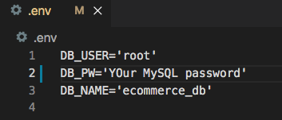

# ORM E-Commerce Back End


## Description

I builded the back end for an e-commerce site by modifying the starter code. I configured a working Express.js API to use Sequelize to interact with a MySQL database.

## User Story

```md
AS A manager at an internet retail company
I WANT a back end for my e-commerce website that uses the latest technologies
SO THAT my company can compete with other e-commerce companies
```

## Acceptance Criteria

```md
GIVEN a functional Express.js API
WHEN I add my database name, MySQL username, and MySQL password to an environment variable file
THEN I am able to connect to a database using Sequelize
WHEN I enter schema and seed commands
THEN a development database is created and is seeded with test data
WHEN I enter the command to invoke the application
THEN my server is started and the Sequelize models are synced to the MySQL database
WHEN I open API GET routes in Postman for categories, products, or tags
THEN the data for each of these routes is displayed in a formatted JSON
WHEN I test API POST, PUT, and DELETE routes in Postman
THEN I am able to successfully create, update, and delete data in my database
```

## Table of Content

- [Installation](#installation)

- [Technology](#technology)

- [Usage](#usage)

- [Contributions](#contributions)

- [License](#license)

- [Questions](#questions)

## Installation

_Steps require to install this project and to get the development environment running:_

1. Run the command below in the terminal:

```bash
npm init
```

2. Run the command below in the terminal to install the MySQL2 package:

```bash
npm install --save mysql2
```

3. Run the command below in the terminal to install the Express package:

```bash
npm i express
```

4. Run the command below in the terminal to install the Sequelize package:

```bash
npm i sequelize
```

5. Run the command below in the terminal to install the dotenv package:

```bash
npm install dotenv
```

- The package.json file should like the image below:


## Technology

- JavaScript
- Node.js
- Express.js
- Postman: [Postman](https://www.postman.com/)
- MySQL2: [MySQL2](https://www.npmjs.com/package/mysql2)
- Sequelize: [Sequelize](https://www.npmjs.com/package/sequelize)
- dotenv: [dotenv](https://www.npmjs.com/package/dotenv)

## Usage
The following video shows how the application is being tested in Postman:

1. Creating the schema from MySQL shell and seed the database from the terminal. 
2. The application's GET routes to return ALL categories, all products, and all tags being tested.
3. The application's GET routes to return a SINGLE category, a single product, and a single tag being tested.
4. The application's POST, PUT, and DELETE routes for categories, products and tags being tested.


[Walkthrough video that demonstrates the functionality of the application.](https://vimeo.com/549755100)
 - https://vimeo.com/549755100

### Steps to set up the application for testing 

- Creating the connection: 

1. Create a .env file and put your credentials in it. 



2. Check that MySQL server is running.


- Create the schema from MySQL shell and seed the database from the terminal:

1. Run the command below 
```bash
mysql -u root -p 
```
2. Create the database.


3. Seed the database by running the command below 
```bash
npm run seed
```

- To generate the application:
1. Run the following command in the terminal:

```bash
node server.js
```
- The application is ready to be tested in Postman


### Database Models

This database contains the following four models, including the requirements listed for each model:

- `Category`

  - `id`

    - Integer.

    - Doesn't allow null values.

    - Set as primary key.

    - Uses auto increment.

  - `category_name`

    - String.

    - Doesn't allow null values.

- `Product`

  - `id`

    - Integer.

    - Doesn't allow null values.

    - Set as primary key.

    - Uses auto increment.

  - `product_name`

    - String.

    - Doesn't allow null values.

  - `price`

    - Decimal.

    - Doesn't allow null values.

    - Validates that the value is a decimal.

  - `stock`

    - Integer.

    - Doesn't allow null values.

    - Set a default value of `10`.

    - Validates that the value is numeric.

  - `category_id`

    - Integer.

    - References the `Category` model's `id`.

- `Tag`

  - `id`

    - Integer.

    - Doesn't allow null values.

    - Set as primary key.

    - Uses auto increment.

  - `tag_name`

    - String.

- `ProductTag`

  - `id`

    - Integer.

    - Doesn't allow null values.

    - Set as primary key.

    - Uses auto increment.

  - `product_id`

    - Integer.

    - References the `Product` model's `id`.

  - `tag_id`

    - Integer.

    - References the `Tag` model's `id`.

### Associations

This application models has the following relationships between them:

- `Product` belongs to `Category`, and `Category` has many `Product` models, as a category can have multiple products but a product can only belong to one category.

- `Product` belongs to many `Tag` models, and `Tag` belongs to many `Product` models. Allow products to have multiple tags and tags to have many products by using the `ProductTag` through model.

## Contributions

The following were contributors to this project:

- [Nadia Dorado](https://github.com/ndorado3)
- GT Coding Bootcamp Projects Design Team

## License

MIT

Copyright (c) [2021] [Nadia Dorado]

Permission is hereby granted, free of charge, to any person obtaining a copy of this software and associated documentation files (the "Software"), to deal in the Software without restriction, including without limitation the rights to use, copy, modify, merge, publish, distribute, sublicense, and/or sell copies of the Software, and to permit persons to whom the Software is furnished to do so, subject to the following conditions:

The above copyright notice and this permission notice shall be included in all copies or substantial portions of the Software.

THE SOFTWARE IS PROVIDED "AS IS", WITHOUT WARRANTY OF ANY KIND, EXPRESS OR IMPLIED, INCLUDING BUT NOT LIMITED TO THE WARRANTIES OF MERCHANTABILITY, FITNESS FOR A PARTICULAR PURPOSE AND NONINFRINGEMENT. IN NO EVENT SHALL THE AUTHORS OR COPYRIGHT HOLDERS BE LIABLE FOR ANY CLAIM, DAMAGES OR OTHER LIABILITY, WHETHER IN AN ACTION OF CONTRACT, TORT OR OTHERWISE, ARISING FROM, OUT OF OR IN CONNECTION WITH THE SOFTWARE OR THE USE OR OTHER DEALINGS IN THE SOFTWARE.

## Questions

For questions about this project please contact me:

- Email: nadiadorado@gmail.com
- Github: https://github.com/ndorado3

